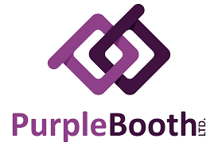

# **_Welcome to First Cake! app._**

> So, you’ve finally done it. You’ve made a genuine connection with another person, you’ve established a mutual interest, you’ve followed each other on Instagram and accidentally liked each other’s selfies from 2013. What comes next is the tricky part: going on an actual date.

> Now the hard part begins, every idea you will have is rife with potential disaster. Dinner and a movie? The movie could be terrible. A hike? Too sweaty. A picnic? Be serious. What if a hawk swoops down and steals all the food, and then there’s the possibility of a tornado? I rest my case.

> Instead, keep it casual and use my app to find your next date spot at the click of a button. All I need from you is to ask your new date what they like for dessert! Awesome! Once you have their response, enter the answer by keyword search and my app will do all the heavy lifting for you... Lets be honest you've already done the hard part, use this revolutionary tool to help you find your "First Cake" spot.

 - 1.  Search our database using a keyword search allowing you to find the perfect "First Cake" spot   
 - 2.  Use the awesome "Save that Cake" feature to keep track of your favorite spots. add comments or as I like to call them "First Cake Notes" to write your thoughts about the spot.   

## **_Getting Started_**

 >**_"These instructions will get you a copy of the project up and running on your local machine"_** 
 ---

###**_Installing_**


First, you'll need to clone down the repo into a directory. Open your terminal and enter

```
git clone git@github.com:stephensenft21c35-React-Capstone-First-Cake-.git
```

After that, open up your editor. You're going to need to do the following: You need to be in the main part of the app by entering in:

```
cd c35-React-Capstone-First-Cake-
```

Since we will be using some pre-populated data at the time, database.json has been set up for you, go to your terminal, enter the command

```
cd api
```

You will need to run the local json-server, run the command

```
json-server -p 5002 -w database.json
```

Before we run the application, you must run the command for the React app. In the terminal, run the following command to go back to the main directory

```
cd ../
```

Afterwords enter the following command into the terminal to start using the application

```
npm start
```

---

##_*Built With*_

[](https://reactjs.org/)

[ ](https://www.npmjs.com/package/reactstrap)
[](https://getbootstrap.com/)
[](https://www.figma.com)
[](https://www.w3schools.com/html/html_css.asp)
[](https://www.json.org)
[]()
[]()

---

###**_Acknowledgments_**
[](https://gist.github.com/PurpleBooth/109311bb0361f32d87a2) README Template Design

___


### **_Authors_**

- **_Stephen Senft_** - Initial work - FirstCake (_IMPORTANT_!!) **"insert logo here"**


#### User Stories

- ###### The Problem

_*A guy asks a girl out and suggests they go somewhere for dessert and coffee.*_

\*_She mentions that she loves chocolate cake.
He puts in a google search for places that serve chocolate cake.. He can't find any reliable results without a lot of research. It takes a decent bit of time and he still can't find a good place to go. Since He is a student of Nashville Software School the guy has learned to be a problem solver and navigate google. Once of his search results ends up being a local favorite and he decides to go there. He picks up some TO-GO dessert. They have a great time and the rest is history...._\*\*

_*The next day He thinks to himself. I wish I had an app to find local dessert spots in the surrounding area that gave the user description, location, and user rating.*_

_*He would like to save these spots for future use and add comments ie notes on how the experience was*_
